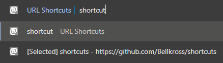
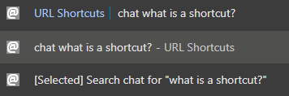

# ⚡ Shortcuts - Lightning Fast Website Access

**Stop typing long URLs!** Create custom shortcuts and access any website instantly from Chrome's address bar.

[See examples](#examples)

## Installation

- Clone the repo via `/some/folder`
- Open `chrome://extensions/`, enable Developer mode, click `Load unpacked` and point to this folder.
- Once the extension is loaded, it will create `myshortcuts/search-engines` and `myshortcuts/shortcuts` folder in your bookmarks bar. So it can write bookmarks in those folders and read them as shortcuts.

## Updating plugin

[How do I update the plugin?](#how-do-i-update-the-plugin)

## Create Your First Shortcut

- Go to any website (like `https://chatgpt.com/`)
- Add a bookmark using plugin
  - Click the extension icon in the Chrome toolbar
  - Type a name (like "chat")
  - Press `Enter`
  - That's it! Your shortcut is ready
- Alternatively, you can add a bookmark using chrome's bookmark manager:
  - Press `Ctrl+Shift+B` to show bookmarks bar
  - Right-click on the `myshortcuts/shortcuts` folder in the bookmarks bar and select "Add page"
  - Name it (like "chat")
  - Set the URL to `https://chatgpt.com/`
  - Click Save

### Use Your Shortcuts

- Click Chrome's address bar (or press `Ctrl+L`)
- Type `@`
- Press `Tab` to call the shortcuts extension
- Type your shortcut name (like `chat`)
- Press `Enter` - you're there instantly!

## Create your first search engine

- Go to any search engine (like `https://chatgpt.com/`)
- Press `Ctrl+Shift+B` to show bookmarks bar
- Go under `myshortcuts/search-engines` bookmark folder in your bookmarks bar
- Name your search engine (like "chat")
- Add a query link (like `https://chatgpt.com/?q=%s` where `%s` is the search term)
- Press Save
- That's it! Your search engine is ready

## Use your search engines

- Click Chrome's address bar (or press `Ctrl+L`)
- Type `@`
- Press `Tab` to call the shortcuts extension
- Type your search engine name (like `chat`)
- Press `Space`
- Input your query (like `Why people use typing hints in python?`)
- Press `Enter` - you're there instantly!

## Enable shortcuts for your existing bookmarks

- Press `Ctrl+Shift+B` to show bookmarks bar
- Drag-and-drop any existing bookmark into the `myshortcuts/shortcuts` folder
- That's it! Your bookmark is now a shortcut

## Examples

### Shortcut Example

Create shortcuts for your most-visited websites:

| Shortcut Name | Shortcut URL |
|-----------|--------|
| `yt` | `https://www.youtube.com/` |

### Search Engine Example

Create shortcuts for your most-visited search engines:

| Search Engine Name | Search Engine URL |
|-----------|--------|
| `g` | `https://www.google.com/search?q=%s` |
| `chat` | `https://chatgpt.com/?q=%s` |

---

## 🔧 How It Works

- Your shortcuts are saved as Chrome bookmarks - they sync across your devices!
- Search engines work with any site that has search URLs ending in `%s`
- Everything is stored locally - no data sent anywhere

---

## ❓ Need Help?

Want to edit/delete shortcuts?

- Go to Chrome bookmarks (`Ctrl+Shift+O`)
- Find the "myshortcuts" folder
- Edit or delete any shortcut/search engine there

Extension not showing?

- Check `chrome://extensions/` and make sure it's enabled

## Why not use search engines and site search feature by Chrome?

- Chrome does not allow to backup neither site search shortcuts nor search engines, so you will lose them if you switch to another machine
- This plugin allows you to backup your shortcuts and search engines as bookmarks, so you can easily restore them on any machine
- More customization options, like if you type "you" in the address bar and press enter while having "youtube" shortcut, it will go to your "youtube" shortcut URL, while chrome will initiate search for "you" in your default search engine

## How do I update the plugin?

### Chrome

For Chrome installations, `git pull` the cloned plugin directory, head to `chrome://extensions`, and click on the reload icon next to the plugin.

### Edge, other browsers

Other browsers are not supported yet
